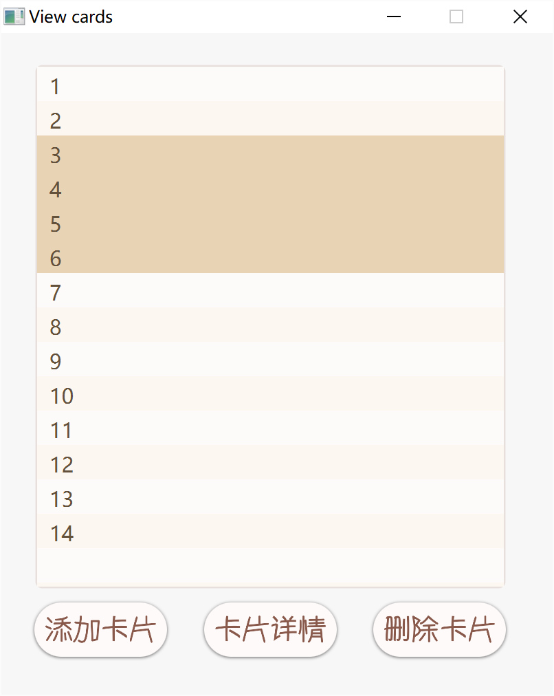

## 《任记》使用不完全指北

### 设计初衷和目的

* 《任记——*Take notes in your OWN way*》是一款基于*javafx*、利用*艾宾浩斯遗忘曲线* 协助记忆的**个性化记忆工具**。

  市场上多数记单词软件都有规定的辞书录入，而支持自定义内容的备忘录、记事本等又往往不支持协助记忆，只能作为记录工具。所以如果想要**记忆一些个性化内容**，譬如一幅画作的内容，一个教室的座位表，一些同学的联系方式、相貌特征，或者一些小语种单词时，将没有合适的软件协助。于是我选择开发了这样一款软件，**核心理念是*"Take notes in your OWN way"*，即高度个性化地记忆。**

### 特色功能介绍

#### 登入系统

* **主登录页面：**

  
 	 

  * 支持用户名密码的录入和比对识别
  * 支持不同用户名用户信息、存储内容独立

* **注册页面：**

  
 	 

  * 支持用户名查重（不能和已有用户用户名重复）
  * 支持密码确认比对，以及密码必须含有字母的简单强度要求

* **找回密码：**

  
 	 

  * 支持用户不存在时提醒
  * 基于电话号码的比对

* **修改密码：**

  
 	 

  * 支持旧密码比对
  * 支持新密码比对，要求含有字母

#### 主界面

* **书架页面：**

  
 	 

  * 左侧状态栏
    * 支持显示当前日期
    * 支持注销、修改账户信息（修改密码）
    * 支持~~会动的二次元美少女~~
      * 支持换装、更换角色
      * 支持眼神追踪鼠标
      * 支持点击互动
      * 支持拍照，可存储图片至本地
  * 书架部分
    * 支持新建笔记本
      * 同名笔记本不可共存，但不同用户可拥有同名笔记本
      * 笔记本支持显示简略信息：名字、卡片数、最后翻阅日期
    * 右侧随机生成诗歌、散文片段

#### 笔记本详细内容

* **点击需要查看的笔记本即可打开：**

  
 	 

  * 支持显示笔记本名字、卡片数、最后翻阅时间
  * 支持统计该笔记本遗忘情况，横轴愈向右表示相对记忆程度愈好的卡片数量
  * 支持重新命名笔记本，新名字不可与现有笔记本重名
  * 支持删除笔记本
  * 支持日历打卡功能，日历中复习过的日期将会以颜文字的形式出现，而没有复习的日期是数字
  * 右下角按钮可回到书架界面

#### 浏览卡片

* **点击浏览卡片进入：**

  
 	 

  
  * 支持添加卡片
  * 支持查看卡片详情，以及修改卡片内容
  * 支持批量选中，删除卡片

#### 制作和修改卡片

* **点击添加卡片，或选择相应卡片点击卡片详情：**

  
 	 

  * 支持插入图片、调整图片缩放大小
  * 支持一定的文本编辑功能，如段落、字体、颜色、复制粘贴等
  * 要求输入卡片简略作为卡片的唯一识别信息，例如所要记的单词、所要记忆的同学姓名等
  * 已有的卡片可直接进行编辑从而更改

#### 复习卡片

* **设置好每日复习的卡片数量（默认100张）后，点击“开始翻阅”**

  
 	 

  * 左侧为显示卡片证明
    * 支持显示还有多少张卡片仍未被复习
    * 点击检查答案显示卡片反面
  * 右侧为点击检查答案后显示的卡片背面，根据记忆情况有“熟悉”“模糊”“忘记”三个选项
    * 每张卡片会根据由**历史上选择过的熟悉、模糊、忘记次数，以及最后一次复习日期至现在的间隔时间，以及设置的当日复习量**进行基于遗忘曲线的计算，得出卡片是否需要再次进行复习。
    * 当所有卡片复习完成后，将弹出提示框，并且自动完成当日打卡
    * 每日可以多次复习

### 设计特色

* 美工特色：软件主题选择偏自然灰色系的栗色，饱和度较低，透明度较低保证了使用起来眼睛的舒适度。

  ​					选择字体以及按钮标识多用圆角减少了尖锐程度，增加了亲和力

* 互动性：增加了可互动的二次元美少女，增强客户体验。~~我可以玩半天~~

  ​				增加了打卡签到功能。随机的人文素材显示和随机生成的签到颜文字也增加了用户依赖度。

* 高度个性化：卡片内容完全可个性化定制。之后还会考虑增加一键导入功能

### 不完全bug统计

* fxml界面渲染加载时间略长
* 主界面注销按钮热区判断有误
* jxbrowser免费使用只有30天，~~会动美少女随时可能离开QwQ~~
